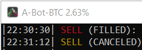
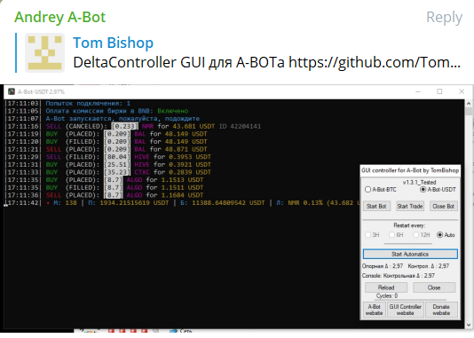

# A-Bot_GUI DeltaController.exe crafted by TomBishop
GIU Controller for A-Bot https://github.com/dpcwee/abot

# Условия запуска контроллера:
0. Windows
1. Файл DeltaController.exe должен находиться в папке с ботом
2. Запуск DeltaController.exe от имени Администратора, т.к. окно А-бота игнорирует комаду на закрытие, если она не от Администратора
3. Версия бота должна быть с Дельтой в title в торгах, уточняйте в телеграм у Андрея, или запустите торги и проверьте, дублируется ли Δ в заголовок окна 
4. Имена файлов бота должны быть: A-Bot-BTC.exe и A-Bot-USDT.exe

СКАЧАТЬ: https://github.com/TomBishop-Auto/A-Bot_GUI/releases

0. НИКАКИХ Гарантий.
1. Если Запущена автоматика, то желательно компьютер не трогать, ну сами понимаете, может быть конфликт с вашими действиями
2. DeltaController не умеет влиять на работу бота: торгов, настроек и всего, что может навредить Вашему Депо, по простому - софт сокращает несколько действий человека в одну кнопку
3. Не стоит закрывать бота в момент, когда идёт активность ордеров в боте - это может привести к сбою в базе данных бота
4. Задача автоматики по максимуму оставлять бота в работе, посему даже если бота ВЫКЛючить, то ВКЛюченная автоматика постарается вернуть его в работу
5. Тестировалось только с одним включенным ботом, как будет себя чувствовать одноврменно с двумя не проверялось PS: Запускайте также 2 копии автоматики для каждого бота и пробуйте
6. Философия работы Контроллера: Запустили Автоматику (нажав на кнопку Start Automatics) лучше убрать руки от мыши и клавы и наблюдать, а если еще не запустили, то тыкайте по кнопкам смотрите что делает
7. Что-то не Нравится ЖМЕМ - RELOAD это перезапустит Контроллер

# Что умеет DeltaController:

1. Вверху 2 радиобокса - выбор версии бота для контроля
2. Кнопка "Start Bot" - запускает бота, выбранного в пункте 1, если бот уже запущен - всплывет предупреждение
3. Кнопка "Start trade" - за человека выполняет команду -s в терминале бота, в случае, если бот уже в торговле - всплывет предупреждение. (PS: Нажимайте её только если бот находится в лобби)
4. Кнопка "Close Bot" - Запрос на закрытие выбранного в пункте 1 бота. Избегайте её нажатия в момент активности Ордеров в боте
5. Подраздел "Restart Every": - 3,6,12 часов пока не доступны, ибо безусловное закрытие бота в момент активности торгов может вызвать сбой базы бота, у меня так и произошло ))
6. Radiobutton AUTO - После нажатия на Кнопку Start Automatics: Запускает каждые 2 мин анализатор изменения Дельты(бота выбранного в 1 пункте) - первый запрос Δ0 становится Опорным, далее в течение 1 минуты, каждые 3сек снова запрашивает Δ1, которая становится Контрольной и если Контрольная Δ1 за 20(60÷3) проверок совпадает с Опорной Δ0 - автоматика выгружает Бота, через 5сек его запускает снова, и еще через 10сек отправляет бота в торги и все это без участия человека. PS:(на 10ой проверке автоматика пытается снять бота с Паузы, мамололи кто по случайности его запаузил)
8. Кнопка "Reload" - Перезапускает окно Контроллера
9. Кнопка "Close" - Закрывает окно Контроллера
10. Cycles: - счетчки перезапуска бота
11. Кнопка "A-Bot website" - открывает в браузере страничку A-Bot - https://github.com/dpcwee/abot
12. Кнопка "GUI Controller website" - открывает в браузере страничку GIU Controller - https://github.com/TomBishop-Auto/A-Bot_GUI
13. Кнопка "Donate website" - открывает в браузере страничку с реквизитами, если появилось жгучее желание поддержать мну

# Donate_lo

1. BNB BEP20 (BSC) - 0x1cb64ae704aa04a979b2096ea9d539660a8c04fe
2. USDT TRC20      - TNdwdecdCGboB2ede7TBwxTqNkwjVEfEQQ
3. BTC             - 1Cftcodfw4NLXwrYi4svYnofHvkuhdF2Jj
4. ETH ERC20       - 0x1cb64ae704aa04a979b2096ea9d539660a8c04fe

# Скрины пльзователей

