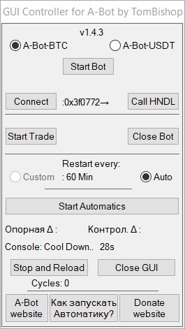

# A-Bot_GUI DeltaController.exe crafted by TomBishop
GIU Controller for A-Bot https://github.com/dpcwee/abot

# Условия запуска контроллера-автоматики:
0. Windows
1. Версия А-бота 1.25 и выше
2. Файлы Автоматики должны находиться в папке с А-ботом к которому будет превязан
3. Имена exe файлов А-бота должны совпадать с именами в настройках файла data\cfg.ini PS: Нельзя удалять строчики из ini может привести к сбою в работе, можно только МЕНЯТЬ параметры

# HELP
Как запускать контроллер новечку:

1. ОБЯЗАТЕЛЬНО выполнить ВСЕ требования из "Условия запуска контроллера" PS: Новечку на 3ий пункт"Условия запуска контроллера" -  можно не обращать внимание
2. Закрываем окно А-Бота, если оно было открыто ранее
3. Запускаем DeltaController.exe от имени Администратора
4. Выбираем необходимого А-Бота в окошке Контроллера
5. Нажимаем кнопку - "Start Bot" в окошке Контроллера - Убеждаемся, что окно А-бота появилось на экране, а в окне Контроллера справа от кнопки "Connect" появились циферки например :0x170179
6. Для проверки жмем кнопку "Call HNDL" - Окно А-бота должно затрястись
7. Нажимаем кнопку "Start trade" в окошке Контроллера, ждем некоторое время - Убеждаемся, что А-Бот начал торговать, в окне А-Бота должна появится длинная строка в конце которой есть дельта Д: которая также дублируется в заголовке\названии окна А-Бота
8. Нажимаем кнопку "Start Automatics" в окошке Контроллера

Для Опытных пользователей:
1. Если потребовалось перезапустить Контроллер или запустить его при уже работающем А-боте, например нажав кнопку "Stop and Reload"
2. Запустив окно Контроллера выберете Вашего бота и нажмите кнопку "Connect" для привязки Контроллера к окну А-Бота, проверьте результат при помощи кнопки "Call HNDL"

_____________________________________________________________________________

# Надо знать
1. Не стоит закрывать бота в момент, когда идёт активность ордеров в боте - это может привести к сбою в базе данных бота
2. Задача автоматики по максимуму оставлять бота в работе, посему даже если бота ВЫКЛючить, то ВКЛюченная автоматика постарается вернуть его в работу
3. Что-то не так с автоматикой? ЖМЕМ - RELOAD это перезапустит Контроллер

# Что умеет DeltaController:

1. Вверху 2 RadioButton - выбор версии А-бота для контроля
2. Кнопка "Start Bot" - запускает А-бота, выбранного в пункте 1, если бот уже запущен - всплывет предупреждение
3. Кнопка "Connect" - пытается подключиться к выбранному в пункте 1 боту
4. Кнопка "Call HNDL" - Шатает окно А-Бота к которому подключен DeltaController
5. Кнопка "Start trade" - за человека выполняет команду -s в терминале А-бота, в случае, если А-бот уже в торговле - всплывет предупреждение. (PS: Нажимайте её только если А-бот находится в лобби)
6. Кнопка "Close Bot" - Запрос на закрытие выбранного в пункте 1 бота. Избегайте её нажатия в момент активности Ордеров в А-боте
7. Подраздел "Restart Every": - Custom пока не доступен, ибо принудительное закрытие А-бота в момент активности торгов может вызвать сбой базы бота, у меня так и произошло ))
8. Radiobutton AUTO - После нажатия на Кнопку Start Automatics: Запускает каждые 2 мин анализатор изменения Дельты(бота выбранного в 1 пункте) - первый запрос Δ0 становится Опорным, далее в течение 1 минуты, каждые 3сек снова запрашивает Δ1, которая становится Контрольной и если Контрольная Δ1 за 20(60÷3) проверок совпадает с Опорной Δ0 - автоматика выгружает Бота, через 5сек его запускает снова, и еще через 10сек отправляет бота в торги и все это без участия человека. PS:(на 10ой проверке автоматика пытается снять бота с Паузы, мамололи кто по случайности его запаузил)
9. Кнопка "Stop and Reload" - Останавливает автоматику и перезапускает окно DeltaController
10. Кнопка "Close GUI" - Закрывает окно DeltaController
11. Cycles: - счетчки перезапуска А-Бота
12. Кнопка "A-Bot website" - открывает в браузере страничку A-Bot - https://github.com/dpcwee/abot
13. Кнопка "Как запускать автоматику" - открывает в браузере страничку GIU Controller - https://github.com/TomBishop-Auto/A-Bot_GUI/blob/main/README.md#help
14. Кнопка "Donate website" - открывает в браузере страничку с реквизитами, если появилось жгучее желание поддержать мну

# СКАЧАТЬ DeltaController: 
https://github.com/TomBishop-Auto/A-Bot_GUI/releases
_____________________________________________________________________________
# Donate_lo

1. BNB ERC20,BEP20(BSC)        - 0x1cb64ae704aa04a979b2096ea9d539660a8c04fe
2. ETH ERC20,BEP20 (BSC)       - 0x1cb64ae704aa04a979b2096ea9d539660a8c04fe

3. USDT ERC20                  - 0x1cb64ae704aa04a979b2096ea9d539660a8c04fe
4. USDT TRC20                  - TNdwdecdCGboB2ede7TBwxTqNkwjVEfEQQ
5. USDT OMNI                   - 17gEgwogKo73ULtfMpWEKtWGZrDUBTReDA
